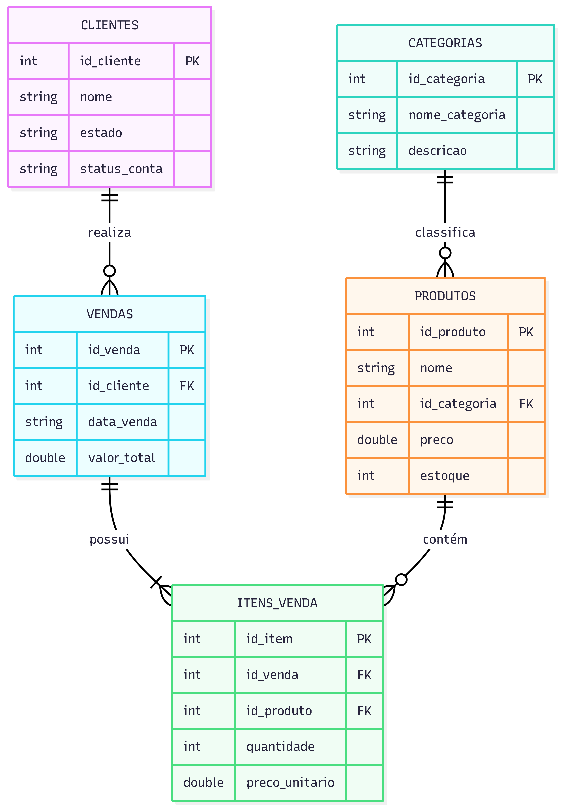

# 01. Setup Origem: SQL Server

Este módulo, baseado no notebook `01_setup_sqlserver.ipynb`, é responsável por configurar o banco de dados relacional que atua como o sistema de origem (OLTP) do projeto. O objetivo é carregar os dados transacionais gerados anteriormente para uma instância do SQL Server 2025.

## 1. Infraestrutura e Conexão

O processo de carga depende de uma infraestrutura devidamente orquestrada para permitir a comunicação entre o ambiente de desenvolvimento e o banco de dados:

*   **Ambiente Docker**: O banco de dados deve estar operacional via Docker Compose, acessível na porta padrão 1433.
*   **Driver de Conexão**: É utilizado o ODBC Driver 18 para SQL Server, garantindo compatibilidade com os recursos mais recentes do motor de banco de dados.
*   **Gerenciamento de Segredos**: As credenciais de acesso (servidor, porta, usuário e senha) são extraídas de variáveis de ambiente via arquivo `.env`, garantindo que informações sensíveis não fiquem expostas no código.

## 2. Definição do Esquema (DDL)

O script realiza a criação automatizada do banco de dados `Ecommerce` e de suas respectivas tabelas, caso ainda não existam. O esquema reflete as cinco entidades principais do negócio:

*   **categorias**: Tabela mestre para classificação de produtos.
*   **produtos**: Catálogo com preços e controle de estoque.
*   **clientes**: Base de usuários cadastrados.
*   **vendas**: Cabeçalho dos pedidos realizados.
*   **itens_venda**: Detalhamento granular de itens por pedido.

### Modelagem do Sistema

O ambiente simula o fluxo completo de uma operação de varejo digital (simplificada). Abaixo, a estrutura de relacionamento entre as entidades:

## 3. Processo de Ingestão de Dados

A carga dos dados é realizada seguindo uma lógica de preservação da integridade e otimização de performance:

*   **Respeito a Dependências**: A ordem de inserção prioriza as tabelas mestre (Categorias e Clientes) antes das tabelas de transação (Vendas e Itens), garantindo que as chaves estrangeiras sejam válidas.
*   **Limpeza em Tempo de Carga**: O script utiliza Pandas para ler os arquivos CSV e realiza o tratamento de strings (strip) para remover espaços excedentes antes da inserção.
*   **Inserção em Lotes (Batch Insert)**: Em vez de inserir registro por registro, o sistema utiliza o método `executemany` com lotes de 2000 registros, reduzindo o tráfego de rede e acelerando o processo.
*   **Verificação de Idempotência**: Antes de iniciar a carga de cada tabela, o script verifica se já existem registros presentes. Caso a tabela já esteja populada, a carga é pulada para evitar duplicidade de dados.

## 4. Validação e Auditoria

Ao final da execução, o módulo realiza uma conferência automatizada para garantir que o estado final do banco de dados está correto:

*   **Contagem de Registros**: Exibe um relatório comparativo com o total de linhas inseridas em cada tabela.
*   **Amostragem**: Realiza uma consulta `SELECT TOP 5` em cada entidade para validar visualmente se os tipos de dados e os conteúdos foram preservados corretamente durante a migração do CSV para o SQL Server.

---

## Próximo Passo

Com o banco de dados transacional devidamente populado e validado, o pipeline prossegue para a etapa de extração e transferência dos dados para o Data Lake. Prossiga para a documentação da **[Ingestão Bronze: SQL Server para MinIO (02)](02_sqlserver_to_minio_csv.md)**.